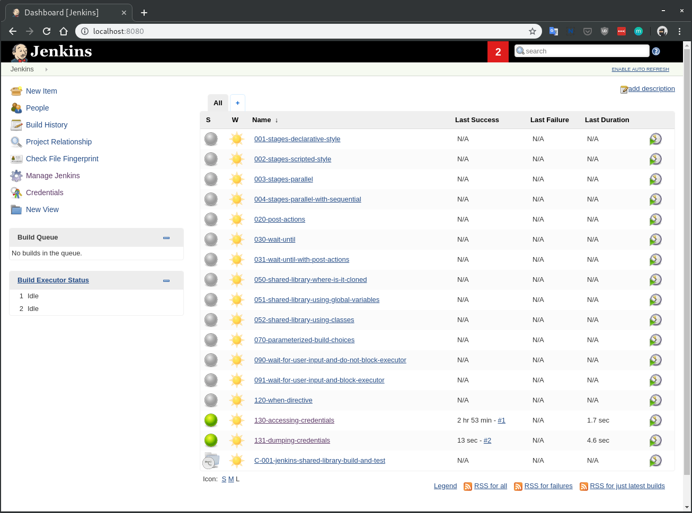

# Jenkinsfiles Examples

Collection of executable Jenkinsfiles loaded automatically into a dockerized Jenkins.
Useful for experimenting or demos.

### Why

[Jenkinsfile](https://jenkins.io/doc/book/pipeline/jenkinsfile/) documentation lacks in examples when it comes to more advanced features.  
I needed working examples of various Jenkinsfiles which I could then modify in my local text editor and automatically convert them into Jenkins jobs.
Unfortunately the best way to test a Jenkinsfile is to run it in a Jenkins instance.  
This project takes away the manual process of copying and pasting a Jenkinsfile into a Jenkins job configuration.
By design job has to be run manually.

### How it works

[jenkinsfile-loader](https://github.com/hoto/jenkinsfile-loader) container uses Jenkins REST API to create Jenkins jobs directly from Jenkinsfiles located in `jenkinsfiles` directory.
It also monitors any change in that folder and will update, create or remove jobs accordingly.  
All files must be named `<job_name>.groovy` where `<job_name>` will be used for the Jenkins job name.
There is no auto-refresh, so after adding or removing files Jenkins page needs to be refreshed manually to reflect changes.

### Blogs using this repository:

* [Creating a Jenkinsfile pipeline](https://medium.com/@AndrzejRehmann/creating-a-jenkinsfile-pipeline-7aefc89b8c67)
* [Private Jenkins Shared Libraries](https://medium.com/@AndrzejRehmann/private-jenkins-shared-libraries-540abe7a0ab7)

### Run

This will pull and start latest docker images

    docker-compose pull
    docker-compose up
   
If you have problem with mounting `/var/run/docker.sock` then remove it from `docker-compose.yml` but you won't be able to run jobs which use docker as an agent.

In the terminal you should see:

    $ docker-compose-up
    ...
    jenkinsfile-loader_1  | 21:27:33 Waiting for Jenkins at http://jenkins:8080/api/json...
    jenkins_1             | INFO: Jenkins is fully up and running
    ...
    jenkinsfile-loader_1  | 21:27:46 Connection to Jenkins established...
    jenkinsfile-loader_1  | 21:27:46 Creating job 001-stages-declarative-style...
    ...

Wait for Jenkins to boot up. Authentication is disabled. Open a browser and go to:

    localhost:8080
    
If you don't see any jobs refresh the browser and check the `docker-compose` logs.

To stop press `CTRL+C` in terminal.  

To remove all containers with all of its data run:

    docker-compoes down

---

### Updating Jenkins

If you wish to update jenkins for some reason then:

1. Update jenkins version in `Dockerfile`
2. Rebuild docker image and start a new jenkins container.
3. Manually update jenkins plugins using the `Install or update Jenkins plugins` guide.

### Install or update Jenkins plugins

If you just want to test new plugins without committing them to git then stop at step 2.

1. Start jenkins container.
2. Manually install or update plugins through the UI.
3. Restart jenkins to verify it's still working.
4. Copy output of the following command to `plugins.txt` file (located in this repository):

        curl -s http://localhost:8080/pluginManager/api/json?depth=1 \
          | jq -r '.plugins[] | "\(.shortName):\(.version)"' \
          | sort
    
5. Rebuild docker image and start a new containers to verify new plugins have been installed:

        docker-compose build
        docker-compose down
        docker-compose up
        
### Components:
  - [jenkins](https://hub.docker.com/_/jenkins/) - Customized with pre-installed plugins and disabled authentication.
  - [jenkinsfile-loader](https://github.com/hoto/jenkinsfile-loader) - Uses Jenkins API and creates jobs directly from Jenkinsfiles.
  
